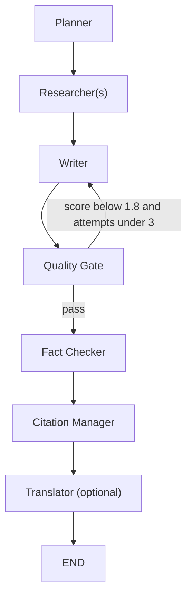

<p align="center">
  <h1 align="center">AI Agentic Studio</h1>
  <p align="center">
    <strong>Production‑ready multi‑agent research & reporting framework</strong>
    <br />
    <a href="https://your-deployment-link"><strong>🌐 Live Demo</strong></a>
    ·
    <a href="https://github.com/GZ30eee/AI-Agentic-Studio/issues"><strong>🐛 Report Bug</strong></a>
    ·
    <a href="https://github.com/GZ30eee/AI-Agentic-Studio/discussions"><strong>💬 Discussions</strong></a>
  </p>
</p>

<p align="center">
  
  
  
  
  
</p>

---

## 📖 Table of Contents

- [✨ Features](#-features)
- [🧠 Orchestration Framework](#-orchestration-framework)
- [👥 Agent Architecture](#-agent-architecture)
- [🔍 Observability with LangSmith](#-observability-with-langsmith)
- [🛡️ Production‑Grade Failure Handling](#%EF%B8%8F-productiongrade-failure-handling)
- [📊 Evaluation Framework](#-evaluation-framework)
- [💰 Cost Tracking](#-cost-tracking)
- [🚀 Deployment](#-deployment)
- [🧪 Testing & CI/CD](#-testing--cicd)
- [📦 Installation](#-installation)
- [📖 Full Deployment Guide](#-full-deployment-guide)
- [📝 License](#-license)

---

## ✨ Features

| Feature | Description |
|---------|-------------|
| 🤝 **Multi‑Agent Orchestration** | LangGraph defines a robust workflow (plan → research → write → quality → fact‑check → cite → translate) with conditional retries. |
| 📚 **Retrieval‑Augmented Generation (RAG)** | Upload PDF, TXT, or CSV files to ground research in your own data. |
| 🧠 **Multi‑Model Support** | Native integration with **OpenAI**, **Anthropic (Claude)**, **Google (Gemini)**, and **Ollama**. |
| 📄 **High‑Impact Reporting** | Automatically generate executive whitepapers, strategic recommendations, and summaries. |
| 💾 **Export Formats** | PDF, DOCX, PPTX, Markdown. |
| ✉️ **Email Delivery** | Send reports directly to stakeholders. |
| ✅ **Built‑in Quality Control** | Readability scoring, fact‑checking, and citation management. |
| 🔎 **Observability** | Full tracing with **LangSmith** (optional) to monitor agent decisions, tool usage, and token costs. |
| 💵 **Cost Tracking** | Log token usage and estimated cost per run. |
| 📈 **Evaluation Framework** | Automated benchmarks to measure report quality. |
| 🔄 **CI/CD** | GitHub Actions run linting, formatting, and tests on every push. |

<p align="center">
  
</p>

---

## 🧠 Orchestration Framework

We explicitly use **LangGraph** to define the state machine and routing logic, while **CrewAI** manages agent groups and tool execution.

> **Why this hybrid?**  
> - **LangGraph** gives fine‑grained control over workflow branching (e.g., retrying the writer if quality is low).  
> - **CrewAI** simplifies agent creation, tool binding, and task delegation.

**Workflow Diagram** (Mermaid):



---

## 👥 Agent Architecture

Each agent is defined with a specific role, goal, backstory, tools, and inputs/outputs:

| Node (Agent)         | Role                          | Tools                     | Input              | Output                 | Memory          |
|----------------------|-------------------------------|---------------------------|--------------------|------------------------|-----------------|
| **Planner**          | Research Director             | (none)                    | topic, num_agents | research plan          | None            |
| **Researcher(s)**    | Domain Researchers            | DuckDuckGo, WebScraper, NewsAPI, RAG | plan snippet | research notes & citations | None (fresh each run) |
| **Writer**           | Senior Technical Consultant   | (none)                    | research, style   | full report            | None            |
| **Quality Gate**     | Quality Analyzer              | (none)                    | report             | quality_score, readability | None          |
| **Fact Checker**     | Fact Checker                  | (none)                    | report             | fact‑check report      | None            |
| **Citation Manager** | Citation Formatter            | (none)                    | citations list    | report with refs       | None            |
| **Translator**       | Translator                    | (none)                    | report, language   | translated report      | None            |

**Handoff Logic** – The workflow is a DAG with conditional edges. If the quality score falls below 1.8 and fewer than 3 refinement attempts have been made, the workflow loops back to the Writer for revision.

**Memory** – No persistent memory across sessions; each run is stateless (except for the RAG collection that persists per session).

---

## 🔍 Observability with LangSmith

When `LANGCHAIN_TRACING_V2=true` and a valid `LANGCHAIN_API_KEY` are set, every run is automatically traced in LangSmith. You can view:

- ✅ Agent decision paths
- ✅ Tool inputs/outputs
- ✅ Token usage per step
- ✅ Latency and errors

<p align="center">
  
  <br />
  <em>Example trace – add your own screenshot</em>
</p>

---

## 🛡️ Production‑Grade Failure Handling

| Mechanism | Description |
|-----------|-------------|
| 🔄 **Retries** | Every critical node is wrapped with `@retry` (exponential backoff, 3 attempts). |
| ⚠️ **Tool Failures** | Each tool catches exceptions and returns a user‑friendly error string; the workflow continues with partial data. |
| 📄 **Empty Reports** | If the writer produces a report shorter than 100 characters, a fallback summary is generated. |
| ⏱️ **Timeouts** | Each `Crew` has a timeout (120s for planning, 300s for research and writing). The overall graph execution is bounded. |
| 🚦 **Rate Limiting** | Agents are configured with `max_rpm=50` to avoid hitting API limits. External HTTP calls use retry sessions. |

---

## 📊 Evaluation Framework

We provide a benchmark suite (`tests/benchmark.py`) that runs the pipeline on a set of representative topics and computes:

- 📏 Report length (≥ 1500 words)
- 📖 Flesch Reading Ease (≥ 30)
- 📚 Number of citations (≥ 3)
- ✅ Fact‑check report (manual inspection)

**Automated Score**: Each run produces a pass/fail result, and the suite calculates an overall success rate.

To run benchmarks locally:
```bash
pytest tests/benchmark.py -v
```

---

## 💰 Cost Tracking

- For **OpenAI** models, we use `get_openai_callback` to capture token usage and cost.
- For other providers, we estimate tokens via `tiktoken` and apply approximate pricing.
- Costs are displayed in the UI and saved in the database per report.

---

## 🚀 Deployment

We deploy the app on **Streamlit Cloud** (or Hugging Face Spaces). A live demo is available at [your-deployment-link].

**Deployment Steps**:
1. Fork the repository.
2. Connect to Streamlit Cloud and set environment variables (`OPENAI_API_KEY`, etc.).
3. Deploy from the `main` branch.

---

## 🧪 Testing & CI/CD

- **Unit Tests**: `tests/test_agents.py`, `tests/test_tools.py`, `tests/test_graph.py` cover individual components.
- **Linting**: `flake8` and `black` enforce style.
- **Continuous Integration**: GitHub Actions run linting, formatting, and the full test suite on every push/PR.

---

## 📦 Installation

```bash
git clone https://github.com/GZ30eee/AI-Agentic-Studio.git
cd AI-Agentic-Studio
python -m venv venv
source venv/bin/activate  # Windows: venv\Scripts\activate
pip install -r requirements.txt
cp .env.example .env
# Edit .env with your API keys
streamlit run app.py
```

---

## 📖 Full Deployment Guide

For detailed setup instructions, local development, and cloud deployment on Streamlit, see the **[Deployment Guide](DEPLOYMENT.md)**.

---

## 📝 License

MIT License – see [LICENSE](LICENSE) for details.
<p align="center">
  Made with ❤️ by <a href="https://github.com/GZ30eee">GZ30eee</a> and contributors.
</p>
