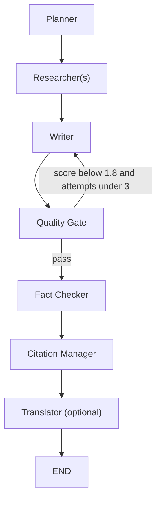

# AI Agentic Studio

[](https://your-deployment-link)
[](https://github.com/GZ30eee/AI-Agentic-Studio/actions/workflows/ci.yml)
[](https://opensource.org/licenses/MIT)

**AI Agentic Studio** is a production‑ready multi‑agent research and reporting framework. It leverages **LangGraph** for stateful orchestration and **CrewAI** for agentic task execution, enabling deep‑dive research, fact‑checking, and generation of professional whitepapers in multiple formats.


---

## ✨ Core Features

- **Multi‑Agent Orchestration** – LangGraph defines a robust workflow (plan → research → write → quality → fact‑check → cite → translate) with conditional retries.
- **Retrieval‑Augmented Generation (RAG)** – Upload PDF, TXT, or CSV files to ground research in your own data.
- **Multi‑Model Support** – Native integration with OpenAI, Anthropic (Claude), Google (Gemini), and Ollama.
- **High‑Impact Reporting** – Automatically generate executive whitepapers, strategic recommendations, and summaries.
- **Export Formats** – PDF, DOCX, PPTX, Markdown.
- **Email Delivery** – Send reports directly to stakeholders.
- **Built‑in Quality Control** – Readability scoring, fact‑checking, and citation management.
- **Observability** – Full tracing with **LangSmith** (optional) to monitor agent decisions, tool usage, and token costs.
- **Cost Tracking** – Log token usage and estimated cost per run.
- **Evaluation Framework** – Automated benchmarks to measure report quality.
- **CI/CD** – GitHub Actions run linting, formatting, and tests on every push.

---

## 🧠 Orchestration Framework

We explicitly use **LangGraph** to define the state machine and routing logic, while **CrewAI** manages agent groups and tool execution.

### Why this hybrid?
- **LangGraph** gives fine‑grained control over workflow branching (e.g., retrying the writer if quality is low).
- **CrewAI** simplifies agent creation, tool binding, and task delegation.

**Workflow Diagram** (Mermaid):



---

## 👥 Agent Architecture

Each agent is defined with a specific role, goal, backstory, tools, and inputs/outputs:

| Node (Agent)         | Role                          | Tools                     | Input              | Output                 | Memory          |
|----------------------|-------------------------------|---------------------------|--------------------|------------------------|-----------------|
| **Planner**          | Research Director             | (none)                    | topic, num_agents | research plan          | None            |
| **Researcher(s)**    | Domain Researchers            | DuckDuckGo, WebScraper, NewsAPI, RAG | plan snippet | research notes & citations | None (fresh each run) |
| **Writer**           | Senior Technical Consultant   | (none)                    | research, style   | full report            | None            |
| **Quality Gate**     | Quality Analyzer              | (none)                    | report             | quality_score, readability | None          |
| **Fact Checker**     | Fact Checker                  | (none)                    | report             | fact‑check report      | None            |
| **Citation Manager** | Citation Formatter            | (none)                    | citations list    | report with refs       | None            |
| **Translator**       | Translator                    | (none)                    | report, language   | translated report      | None            |

**Handoff Logic** – The workflow is a DAG with conditional edges. If the quality score falls below 1.8 and fewer than 3 refinement attempts have been made, the workflow loops back to the Writer for revision.

**Memory** – No persistent memory across sessions; each run is stateless (except for the RAG collection that persists per session).

---

## 🔍 Observability with LangSmith

When `LANGCHAIN_TRACING_V2=true` and a valid `LANGCHAIN_API_KEY` are set, every run is automatically traced in LangSmith. You can view:

- Agent decision paths
- Tool inputs/outputs
- Token usage per step
- Latency and errors

 *(add your own screenshot)*

---

## 🛡️ Production‑Grade Failure Handling

- **Retries**: Every critical node is wrapped with `@retry` (exponential backoff, 3 attempts).
- **Tool Failures**: Each tool catches exceptions and returns a user‑friendly error string; the workflow continues with partial data.
- **Empty Reports**: If the writer produces a report shorter than 100 characters, a fallback summary is generated.
- **Timeouts**: Each `Crew` has a timeout (120s for planning, 300s for research and writing). The overall graph execution is bounded.
- **Rate Limiting**: Agents are configured with `max_rpm=50` to avoid hitting API limits. External HTTP calls use retry sessions.

---

## 📊 Evaluation Framework

We provide a benchmark suite (`tests/benchmark.py`) that runs the pipeline on a set of representative topics and computes:

- Report length (≥ 1500 words)
- Flesch Reading Ease (≥ 30)
- Number of citations (≥ 3)
- Fact‑check report (manual inspection)

**Automated Score**: Each run produces a pass/fail result, and the suite calculates an overall success rate.

To run benchmarks locally:
```bash
pytest tests/benchmark.py -v
```

---

## 💰 Cost Tracking

- For **OpenAI** models, we use `get_openai_callback` to capture token usage and cost.
- For other providers, we estimate tokens via `tiktoken` and apply approximate pricing.
- Costs are displayed in the UI and saved in the database per report.

---

## 🚀 Deployment

We deploy the app on **Streamlit Cloud** (or Hugging Face Spaces). A live demo is available at [your-deployment-link].

**Deployment Steps**:
1. Fork the repository.
2. Connect to Streamlit Cloud and set environment variables (`OPENAI_API_KEY`, etc.).
3. Deploy from the `main` branch.

---

## 🧪 Testing & CI/CD

- **Unit Tests**: `tests/test_agents.py`, `tests/test_tools.py`, `tests/test_graph.py` cover individual components.
- **Linting**: `flake8` and `black` enforce style.
- **Continuous Integration**: GitHub Actions run linting, formatting, and the full test suite on every push/PR.

---

## 📦 Installation

```bash
git clone https://github.com/GZ30eee/AI-Agentic-Studio.git
cd AI-Agentic-Studio
python -m venv venv
source venv/bin/activate  # Windows: venv\Scripts\activate
pip install -r requirements.txt
cp .env.example .env
# Edit .env with your API keys
streamlit run app.py
```

---

## 📝 License

MIT License – see [LICENSE](LICENSE) for details.
